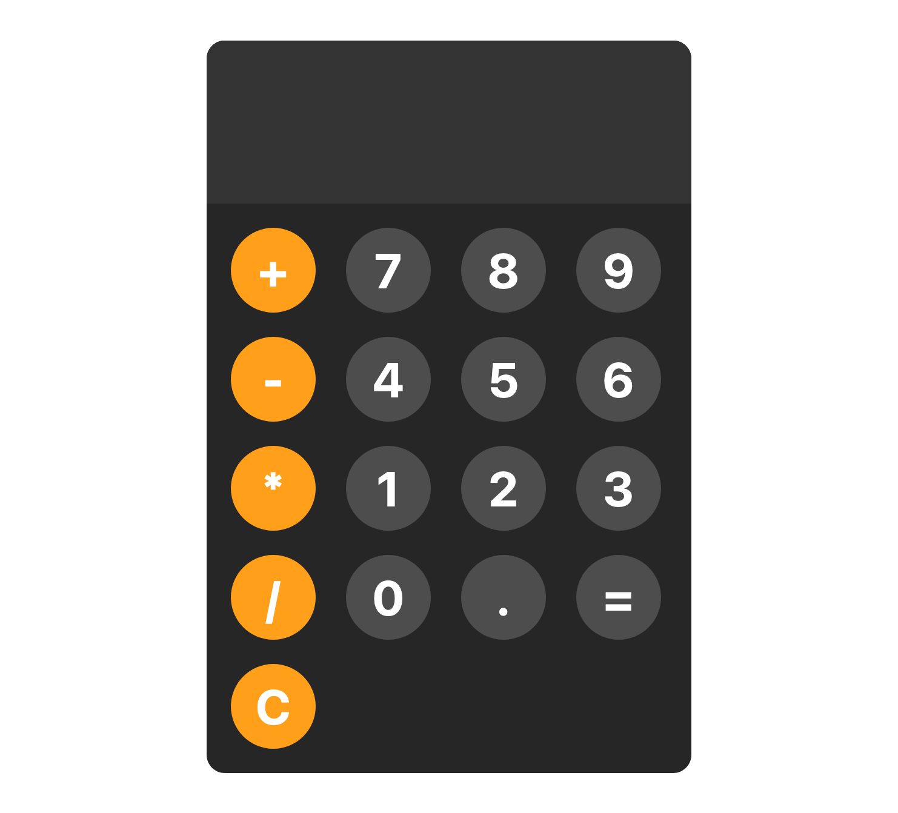

# Simple Calculator

## Summary
This is a simple calculator project built using HTML, CSS, and JavaScript. It performs basic arithmetic operations such as addition, subtraction, multiplication, and division.

## Project Link
[Simple Calculator](https://billalben.github.io/simple-calculator/)

## Screenshot

## Features
- Addition, subtraction, multiplication, and division operations.
- User-friendly interface.
- Responsive design for various screen sizes.
- Basic error handling for invalid inputs.
